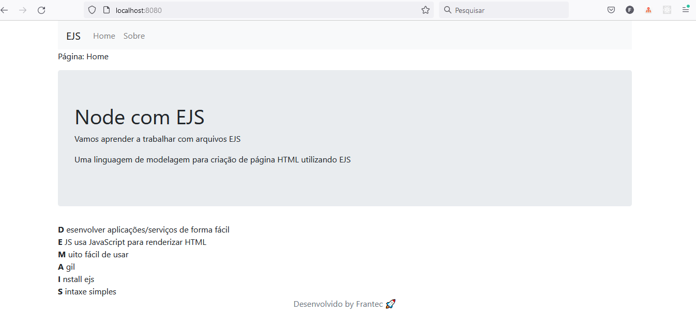

# RocketSeat Trilha Discovery - EJS+NodeJS

Hi my name is Francisco Menezes

This project was developed with guidelines from the RocketSeat website on the Discovey Trail. Purpose of creating pages using NodeJS + EJS. Great tool to put JavaScript HTML and CSS skills into practice.

See details about the course at [RocketSeat ](https://app.rocketseat.com.br/discover) for more information.

<!-- This project is published on GithubPages see -> [QR code component](https://frantecbh.github.io/qr-code-component-react/). -->

## libraries
- NodeJS
- JavaScript
- HTML
- CSS
- [GitHub Pages](https://pages.github.com/)

## Available Scripts

clone the project

In the project directory, you can run:

### `yarn`
or
### `npm install`

Next
### `yarn start`

Runs the app in the development mode.\
Open [http://localhost:8080](http://localhost:8080) to view it in the browser.